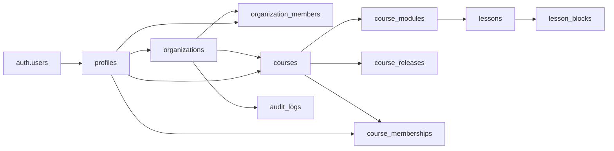

# Курсор

Самодостаточное веб-приложение для создания, публикации и прохождения курсов на любую тему. Языковые курсы — один из профилей продукта, а не отдельная сущность или отдельная база.

Этот `README.md` — единственный актуальный источник документации проекта. Схема ниже описывает фактические таблицы текущего Supabase-проекта. SQL из выгрузки Supabase, помеченный как context only, нельзя выполнять как миграцию.

## Что уже работает

- Каталог собственных и доступных пользователю курсов.
- Универсальный пустой курс и языковой профиль с уровнями.
- Создание, настройка, публикация и удаление курса.
- Модули и уроки с drag-and-drop сортировкой.
- Мгновенное дублирование уроков и модулей.
- Массовое выделение уроков: удержание включает выбор, `Shift + клик` выбирает диапазон.
- Редактор урока из блоков, настройка разделов и живой предпросмотр.
- Текст, теория, PDF, аудио, карточки, диалоги, практика и тестовые блоки.
- Отдельный полноэкранный режим прохождения курса и урока.
- Глобальные уведомления о действиях.
- Локальный режим без Supabase для разработки интерфейса.

Календарь и расписание пока не реализованы.

## Технологии

- Vue 3 и Composition API
- TypeScript
- Vite 7
- Pinia
- Vue Router
- Supabase Auth, Postgres и Storage
- `vue-draggable-plus`
- Lucide icons
- Собственные UI-компоненты и CSS без UI-фреймворка

## Быстрый запуск

Требуется Node.js 20.19+.

```bash
npm install
npm run dev
```

Приложение откроется на [http://localhost:5173](http://localhost:5173).

Без переменных Supabase приложение запускается в локальном режиме. Курсы сохраняются в `localStorage`; авторизация и серверные роли в этом режиме отключены.

### Команды

```bash
npm run dev        # локальный Vite-сервер
npm run typecheck  # проверка TypeScript
npm run build      # typecheck и production-сборка в dist/
```

## Настройка окружения

Создайте `.env` из `.env.example`:

```env
VITE_SUPABASE_URL=https://YOUR_PROJECT.supabase.co
VITE_SUPABASE_PUBLISHABLE_KEY=YOUR_PUBLISHABLE_KEY
```

Используется только публичный publishable/anon key. `service_role` нельзя помещать во frontend или коммитить в репозиторий.

После изменения `.env` перезапустите Vite.

## Маршруты приложения

| Маршрут | Назначение |
|---|---|
| `/app/courses` | каталог курсов |
| `/app/courses/:courseId` | программа и настройки курса |
| `/app/lessons/:lessonId/editor` | редактор урока |
| `/preview/courses/:courseId` | прохождение курса |
| `/preview/lessons/:lessonId` | прохождение отдельного урока |
| `/app/settings` | профиль и настройки рабочего пространства |
| `/auth` | вход и регистрация |

`/` и `/app` перенаправляются на `/app/courses`. Если Supabase настроен, закрытые маршруты требуют авторизованную сессию.

## Структура проекта

```text
src/
├─ assets/styles/          app, design-system и feature-стили экранов
├─ components/
│  ├─ app/                 навигация и глобальные поверхности приложения
│  ├─ ui/                  адаптеры @neytron/compact-ui
│  ├─ common/              простые переиспользуемые элементы
│  ├─ course/              каталог и управление курсом
│  └─ lesson/
│     ├─ editor/           конструктор урока
│     └─ player/           прохождение и практические блоки
├─ composables/            сценарии страниц и переиспользуемое состояние
├─ data/                   каталоги блоков и шаблоны
├─ layouts/                обычный и полноэкранный layout
├─ pages/                  страницы, соответствующие маршрутам
├─ router/                 маршруты и auth guard
├─ services/               Supabase, mapper, файлы и persistence
├─ stores/                 Pinia: auth, курсы, layout, уведомления
├─ types/                  доменные TypeScript-типы
└─ utils/                  чистые вспомогательные функции
```

Стили также следуют LIFT: `design-system.css` — единственный источник токенов и контролов, `app.css` содержит общие поверхности, остальные файлы принадлежат конкретным features.
Границы ответственности следуют LIFT:

- Экран собирает готовые компоненты и вызывает composable.
- Composable хранит состояние пользовательского сценария.
- Store координирует реактивные данные приложения.
- Service выполняет запросы и инфраструктурные операции.
- Mapper переводит строки базы в универсальную доменную модель.
- UI-компоненты не знают о Supabase.

## Модель курса

Основная иерархия одинакова для любых направлений:

```text
Course
└─ CourseModule[]
   └─ Lesson[]
      └─ LessonBlock[]
```

Тип курса не требует отдельной таблицы:

- `general` — универсальный курс; в БД `language_code` хранит техническое значение `und`, уровни пустые.
- `language` — языковой курс; заполнены язык и, при необходимости, начальный/целевой уровни.

Шаблоны создают только начальные настройки. Контент курса всегда хранится в обычных `courses`, `course_modules`, `lessons` и `lesson_blocks`.

## Supabase

### Подключение существующего проекта

1. В Supabase откройте **Project Settings → API** или **Connect**.
2. Перенесите Project URL и publishable key в `.env`.
3. В **Authentication → URL Configuration** задайте локальный Site URL `http://localhost:5173` и Redirect URL `http://localhost:5173/**`.
4. Убедитесь, что включены RLS-политики и доступны RPC, перечисленные ниже.
5. Перезапустите `npm run dev`.

### Разворачивание пустого проекта

Исполняемые SQL-файлы находятся в `supabase/sql/`. Применяйте их по порядку:

1. `00_extensions_and_types.sql`
2. `01_core.sql`
3. `02_course_content.sql`
4. `03_learning.sql`
5. `05_functions_and_triggers.sql`
6. `06_rls.sql`
7. `07_storage.sql`
8. `08_views.sql`
9. `09_remove_learners_and_analytics.sql`
10. `10_course_access_roles.sql`

Файлы `03` и `09` отражают историю перехода от расширенной learner-модели к текущей компактной базе; для новой базы применяется вся цепочка. Не запускайте эту цепочку поверх рабочего production-проекта без резервной копии и просмотра diff схемы.

### RPC, необходимые frontend

| RPC | Использование |
|---|---|
| `publish_course(course_id, changelog)` | создаёт release и публикует курс |

Регистрация пользователя также должна создавать `profiles`, личную организацию и membership организации через trigger базы.

### Storage

Frontend использует приватный bucket `lesson-assets` для аудио и PDF. Путь имеет форму:

```text
{organizationId}/{courseId}/{lessonId}/{blockId}/{fileName}
```

Чтение выполняется через временные signed URL. Допустимые аудиофайлы: MP3, M4A, OGG и WAV до 50 МБ. PDF проверяется по MIME/расширению и ограничен 100 МБ.

## Фактическая база данных

Текущий Supabase содержит 17 прикладных таблиц. `auth.users` принадлежит Supabase Auth и не входит в это число.


```mermaid
flowchart LR
  AU["auth.users"] --> P["profiles"]
  P --> O["organizations"]
  O --> OM["organization_members"]
  P --> OM
  O --> C["courses"]
  P --> C
  C --> M["course_modules"]
  M --> L["lessons"]
  L --> B["lesson_blocks"]
  C --> R["course_releases"]
  C --> CM["course_memberships"]
  P --> CM
  O --> AL["audit_logs"]
```

### Пользователи и организации

| Таблица | Назначение | Основные поля и связи |
|---|---|---|
| `profiles` | профиль пользователя приложения | `id → auth.users`, `email`, `display_name`, `avatar_url`, `locale`, `timezone` |
| `organizations` | рабочее пространство | `owner_id → profiles`, уникальный `slug`, `logo_path`, JSON `settings` |
| `organization_members` | участники организации | `organization_id`, `user_id`, enum `role` |
| `audit_logs` | журнал значимых действий | организация, пользователь, действие, тип/ID сущности, JSON `metadata` |

Роли организации: `owner`, `admin`, `editor`, `viewer`.

### Курсы и уроки

| Таблица | Назначение | Основные поля и связи |
|---|---|---|
| `courses` | корень курса | организация, автор, slug, название, язык/уровни, учебный темп, статус, видимость, текущий release |
| `course_modules` | упорядоченные разделы курса | `course_id`, `title`, `description`, `position`, `is_published` |
| `lessons` | упорядоченные уроки модуля | `course_id`, `module_id`, slug, цели, длительность, проходной балл, статус, preview-флаг |
| `lesson_blocks` | содержимое урока | `lesson_id`, тип, позиция, публичный/приватный JSON, настройки, обязательность, баллы, версия схемы |
| `course_releases` | неизменяемые снимки публикаций | курс, версия, JSON `snapshot`, счётчики, changelog, автор и дата публикации |

Статусы курса: `draft`, `published`, `archived`. Видимость: `private`, `unlisted`, `public`. Статусы урока: `draft`, `published`, `archived`.

`lesson_blocks.public_content` содержит данные, доступные ученику. `private_content` хранит правильные ответы и другую авторскую часть. `settings` предназначен для параметров отображения/поведения. Изменение формата сопровождается увеличением `schema_version`.

Типы блоков, разрешённые текущим constraint базы:

```text
heading, rich_text, callout, image, audio, video, file,
vocabulary, flashcards, grammar, example,
single_choice, multiple_choice, text_input, fill_blanks,
matching, ordering, sentence_builder, translation, listening,
open_answer, divider, summary, homework
```

Frontend сейчас предоставляет подмножество этих форматов и отображает их через доменные типы `heading`, `text`, `callout`, `audio`, `pdf`, `grammar`, `vocabulary`, `practice`, `conversation`, `flashcards`, `error_correction`, `translation`, `single_choice`. Преобразование в значения БД централизовано в `lesson-block-content.service.ts`.

### Доступ к курсам

| Таблица | Назначение | Основные поля и связи |
|---|---|---|
| `course_memberships` | участие ученика в курсе | `course_id`, `user_id`, фиксированная роль `learner`, `joined_at` |

Автор определяется через `courses.owner_id`; отдельная membership автора не нужна. Один пользователь может быть автором своих курсов и учеником в чужих.

## Доступ и безопасность

- Все прикладные таблицы должны быть защищены Row Level Security.
- Создатель курса управляет своим курсом, модулями, уроками, блоками и публикациями.
- Ученик читает только доступный опубликованный курс и не имеет доступа к редактору.
- Роли организации управляют административными возможностями рабочего пространства.
- Правильные ответы не должны попадать в `public_content`.
- Storage закрыт; клиент получает signed URL.
- Любые изменения схемы выполняются миграцией и проверяются на тестовом Supabase-проекте до production.

## Как приложение работает с данными

1. `auth.ts` восстанавливает Supabase-сессию и загружает организацию пользователя.
2. `courses.ts` гидратирует Pinia store из Supabase или локального кэша.
3. `course-repository.service.ts` выполняет CRUD и сортировку.
4. `course-mapper.service.ts` переводит строки Supabase в доменные `Course`, `CourseModule`, `Lesson`, `LessonBlock`.
5. Редактор изменяет реактивную модель и сохраняет узкие операции через store/service.
6. Публикация вызывает `publish_course`, который создаёт snapshot в `course_releases`.
7. Проигрыватель использует опубликованный или доступный пользователю курс.

Дублирование сначала оптимистично вставляет копию в UI, затем сохраняет её в Supabase и откатывает временный элемент при ошибке. Массовое удаление уроков удаляет связанные assets и записи уроков; зависимые блоки и прогресс должны обрабатываться внешними ключами текущей схемы.

## Проверка перед изменениями

```bash
npm run typecheck
npm run build
```

Перед изменением SQL сделайте резервную копию Supabase и сравните фактическую схему с ожидаемой. Приложенная выгрузка схемы предназначена только для документации: порядок таблиц и constraints в ней не гарантирует исполняемость.
## Calendar integration API

Courses exposes an opaque personal-token API through the
`courses-integration` Supabase Edge Function.

Apply migrations through `17_integration_api_tokens.sql`, set the
`COURSES_PUBLIC_APP_URL` Edge Function secret, and deploy the function with
JWT verification disabled as declared in `supabase/config.toml`.

Use the deployed function URL as the API base:

```text
https://<project>.supabase.co/functions/v1/courses-integration
```

Read-only endpoints:

```text
GET <base>/integration/v1/courses
GET <base>/integration/v1/courses/{courseId}/manifest?releaseId={releaseId}
```

Both endpoints require `Authorization: Bearer <personal-token>`. Users create
and revoke tokens on the Courses settings page; the raw secret is displayed
only once.
